[Português Brasileiro](https://github.com/Gilberto-Mascena/Z590-AORUS-PRO-AX/blob/main/README-pt_br.md) | [English](https://github.com/Gilberto-Mascena/Z590-AORUS-PRO-AX/blob/main/README.md)

# *EFI OC Gigabyte Z590 AORUS PRO AX*

##

## *Sistemas operacionais*

  
    
    
   
     

  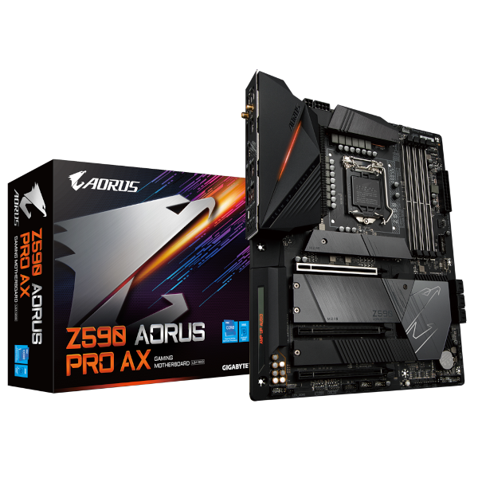

---

_**Minha configuração**_

- _**Placa-mãe**_
    - <a href="https://www.gigabyte.com/br/Motherboard/Z590-AORUS-PRO-AX-rev-10#kf" target="_blank">*Gigabyte Z590 AORUS PRO AX*</a>
- _**Versão da Bios**_
    - *F11*
- _**Gabinete**_
  - *AIGO DARKFLASH C285-BK-4F*
- _**Fonte**_
  - *SUPER FLOWER - LEGION GX PRO 750W 80 PLUS GOLD*
- _**CPU**_
  - *Core i9 11900K (QV1K es)*
- _**Water Cooler**_
  - *SUPER FRAME SF-W360*
- _**NVME M.2**_
  - *XPG GAMMIX S41 512GB / macOS*
- _**NVME M.2**_
  - *XPG GAMMIX S41 512GB / Windows 11*
- _**NVME M.2**_
  - *XPG GAMMIX S11L 256GB / Ubuntu*
- _**GPU**_
  - *XFX AMD Radeon RX 6600 SWFT 210*
> [!NOTE]
> *A série Navi21 6000 foi incorporada ao macOS 11.4 e a Navi23 ao macOS 12.1. Para mais detalhes, consulte [Gpus AMD nativas](https://dortania.github.io/GPU-Buyers-Guide/modern-gpus/amd-gpu.html#native-amd-gpus)*

##

- _**Memória**_
  - *CORSAIR VENGEANCE LPX 4x16GB 64GB*
- _**WI-FI / Bluetooth**_
  - *Intel AX200*
> [!NOTE]
> _Para mais informações sobre placas Intel WiFi compatíveis, consulte: [OpenIntelWireless](https://openintelwireless.github.io/itlwm/Compat)_

##

- _**Rede**_
  - *Intel I225-V*  
---

## _Navegação por tópicos_

- [*O que funciona*](#ancora1)
- [*Resultados do Geekbench*](#ancora2)
- [*Capturas de telas*](#ancora3)
- [*Kexts usados, (todas releases)*](#ancora4)
- [*Ferramentas recomendadas*](#ancora5)
- [*Configurações de BIOS Intel*](#ancora6)
- [*Agradecimentos*](#ancora7)
- [*Licença* ](#ancora8)

---

<h2>O que funciona</h2>

- [x] *Som*
- [x] *Rede*
- [x] *WI-FI*
- [x] *Bluetooth*
- [x] *USB*
- [x] *Sleep*

[Voltar](#ancora)

<h2>Resultados do Geekbench</h2>

* _**CPU QV1K es**_
*Como é um processador de engenharia, requer uma chave de ativação [`Geekbench`](https://www.geekbench.com) para gerar os testes, não tenho!*

[Voltar](#ancora)

## Capturas de telas

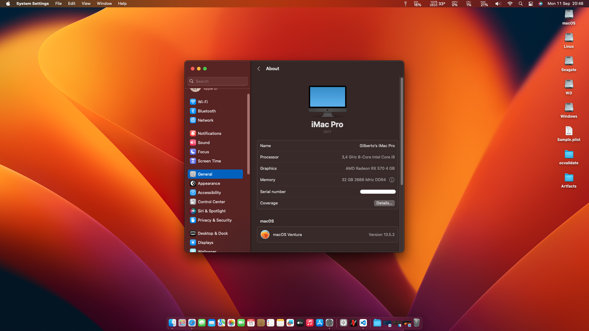
---
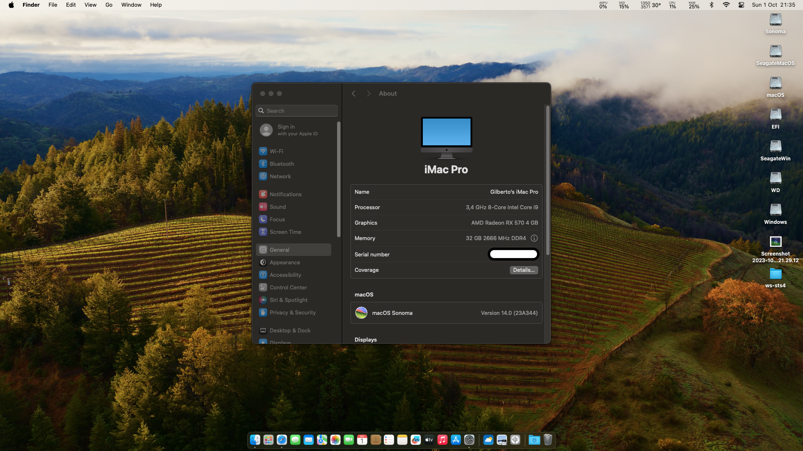
---
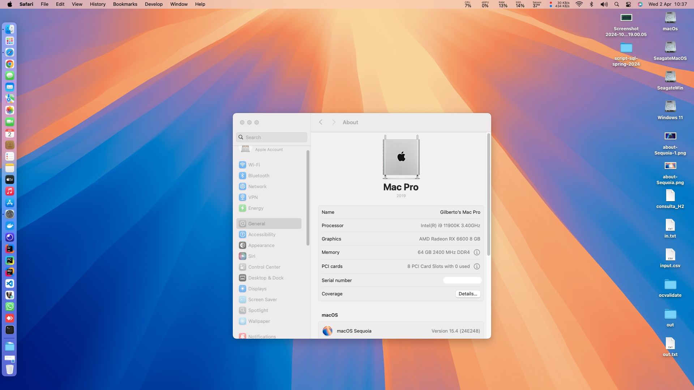

<h2>Audio</h2>

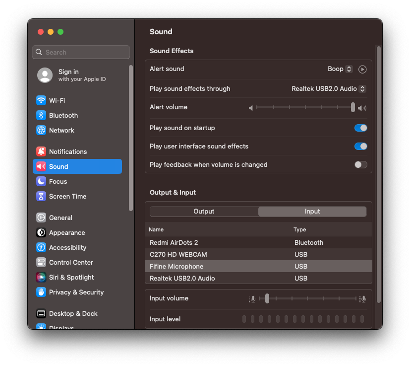

<h2>Rede e WI-FI</h2>

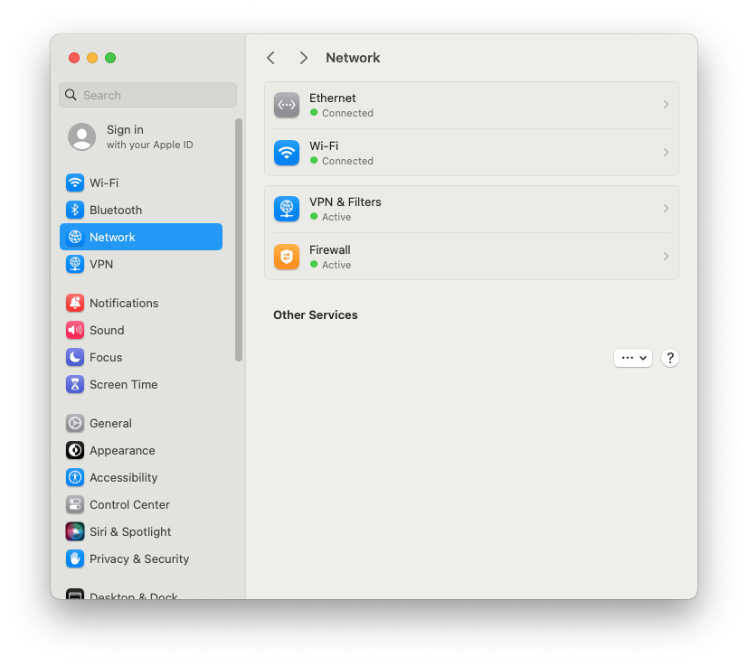

<h2>Bluetooth</h2>

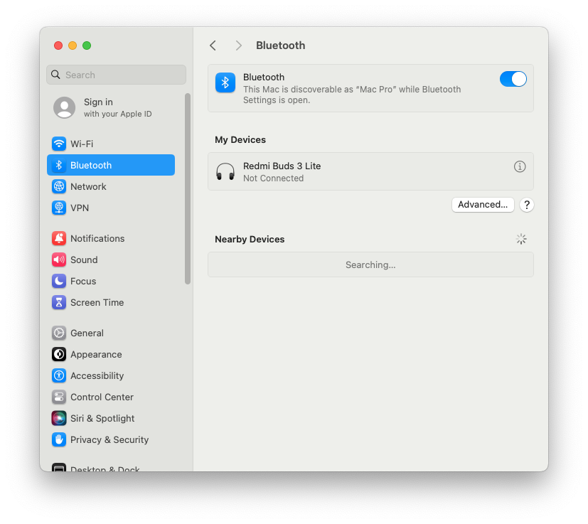

<h2>Perifericos</h2>

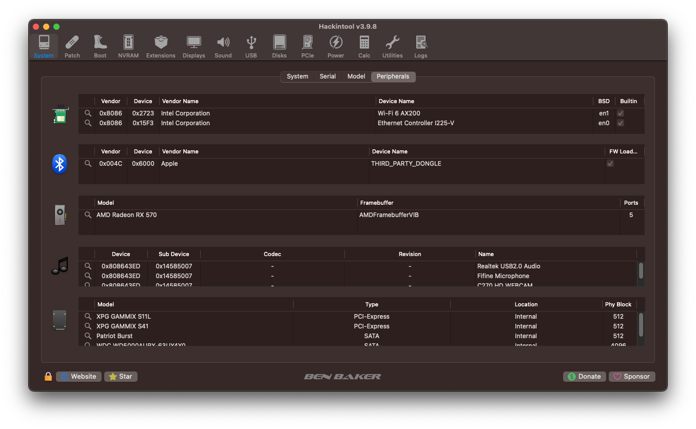

<h2>Versão do OpenCore</h2>

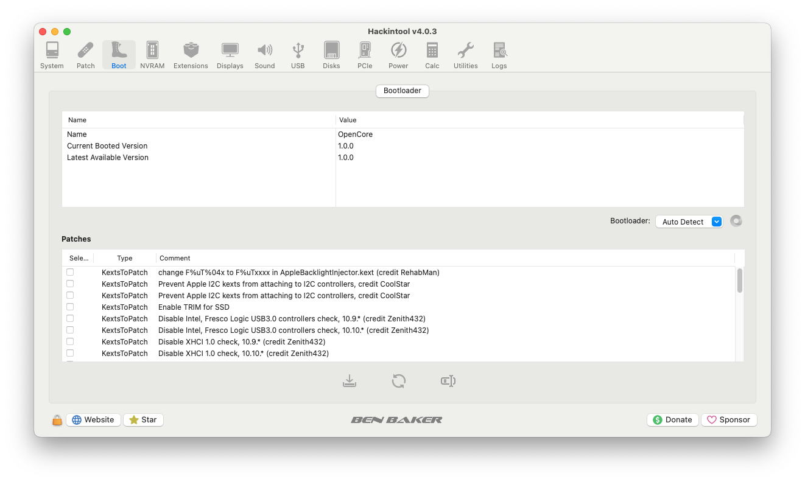

<h2>Kexts</h2>

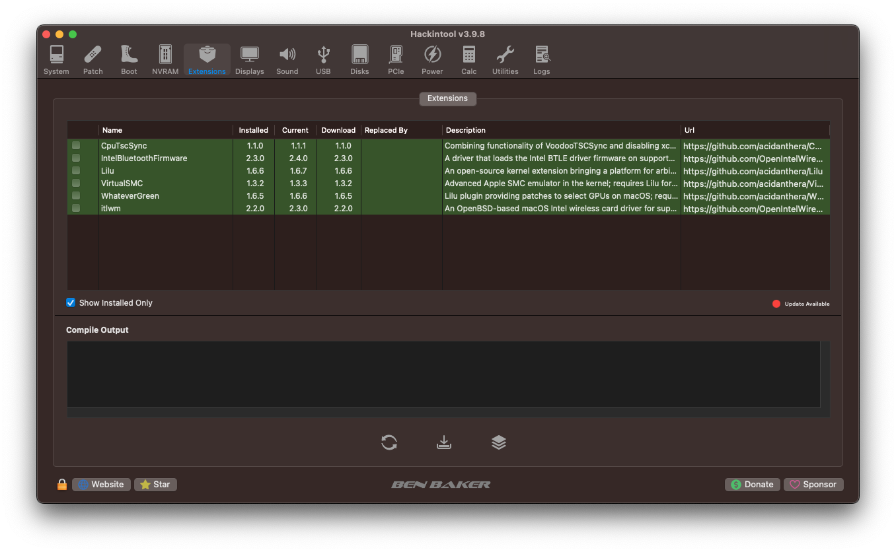

<h2>Mapeamento de portas USB</h2>

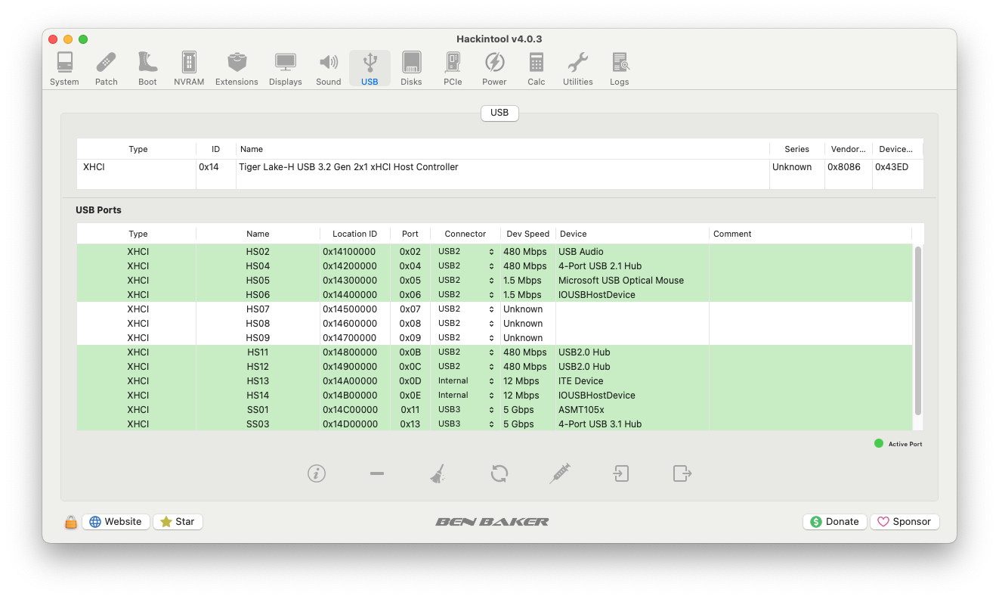

[Voltar](#ancora)

<h2>Kexts usadas, (todas releases)</h2>

- *[`WhateverGreen.kext`](https://github.com/acidanthera/WhateverGreen)*
- *[`Lilu.kext`](https://github.com/acidanthera/Lilu)*
- *[`VirtualSMC`](https://github.com/acidanthera/VirtualSMC), somente: `VirtualSMC.kext`, `SMCProcessor.kext` e `SMCSuperIO.kext`*.
- *[`AppleInteli210Ethernet.kext`](https://github.com/luchina-gabriel/youtube-files/raw/main/AppleIntelI210Ethernet.kext.zip)*
- *[`AppleIGC.kext`](https://github.com/SongXiaoXi/AppleIGC) como opção, se sua internet se conectar, mas você não conseguir navegar, remova AppleInteli210Ethernet.kext e faça um OC Clean Snapshot, isso deve resolver seu problema de internet*
- *[`CpuTscSync.kext`](https://github.com/acidanthera/CpuTscSync)*
- *`USBMap.kext`*
- *[`AirportItlwm.kext`](https://github.com/OpenIntelWireless/itlwm/releases) use a versão correspondente ao macOS*
- *[`BluetoolFixup.kext`](https://github.com/acidanthera/BrcmPatchRAM/releases)*
- *[`IntelBluetoothFirmware.kext`](https://github.com/OpenIntelWireless/IntelBluetoothFirmware/releases)*
- *[`IntelBTPatcher.kext`](https://github.com/OpenIntelWireless/IntelBluetoothFirmware/releases)*

[Voltar](#ancora)

<h2>Ferramentas recomedadas</h2>

* _**Recomendação 1**_
  * *Use [`GenSMBIOS`](https://github.com/corpnewt/GenSMBIOS), para gerar novas seriais para seu SMBIOS a fim de evitar conflitos com iServices*
* _**Recomendação 2**_
  * *Use [`ProperTree`](https://github.com/corpnewt/ProperTree), para editar seu config.plist*
* _**Recomendação 3**_
  * *Use [`USBMap`](https://github.com/corpnewt/USBMap), para mapear suas portas USB, a partir do OC 0.9.3, elas podem ser mapeadas com XHCIPortLimit habilitado em config.plist + [`USBInjectAll`](https://github.com/Sniki/OS-X-USB-Inject-All/releases)*
* _**Recomendação 4**_
  * *Extraia seu DSDT do Windows.*
  * *Use [`SSDTTime`](https://github.com/corpnewt/SSDTTime), gere seus patches SSDT*
* _**Recomendação 5**_
  * *Use [`MaciASL`](https://github.com/acidanthera/MaciASL), para compilar seus patches de SSDT no Mac*
* _**Recomendação 6**_
  * *Use [`MountEFI`](https://github.com/corpnewt/MountEFI/blob/update/Mount%20EFI%20Automator%20Quick%20Action.zip), para montar EFI no macOS*

[Voltar](#ancora)

<h2>Configurações de BIOS Intel</h2>

- [*OpenCore Install Guide*](https://dortania.github.io/OpenCore-Install-Guide/config.plist/comet-lake.html#intel-bios-settings)

[Voltar](#ancora)

## [_Criando o instalador do macOS no Windows ou Linux_](https://github.com/Gilberto-Mascena/How-to-create-a-macOS-installer-without-a-Mac)

## *Agradecimentos*

- [*Acidanthera Team*](https://github.com/acidanthera)
- [*CorpNewt*](https://github.com/corpnewt)
- [*CrisHotpatch*](https://t.me/crishotpatch)
- [*Dortania*](https://dortania.github.io/OpenCore-Install-Guide/config.plist/comet-lake.html#platforminfo)
- [*Dicas do Mateus*](https://www.youtube.com/c/DicasdoMateus)
- [*Gabriel Luchina*](https://www.youtube.com/c/gabrielluchina)
- [*Shaneee*](https://github.com/Shaneee/AppleIGB)
- [*SongXiaoXi*](https://github.com/SongXiaoXi/AppleIGC?tab=readme-ov-file)
- [*OpenIntelWireless*](https://github.com/OpenIntelWireless)
- *E outros*

[Voltar](#ancora)

## *Licença* 

[*Licença MIT*](./LICENSE.md) (*MIT*)

### Gilberto | Dev _2023_

[Voltar](#ancora)
