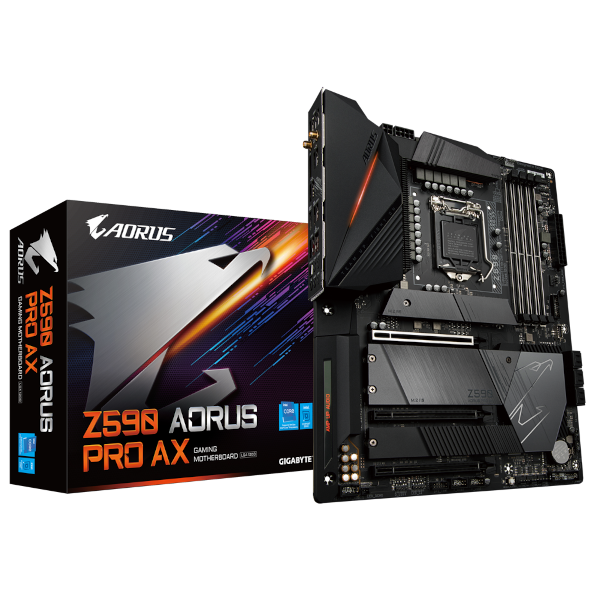
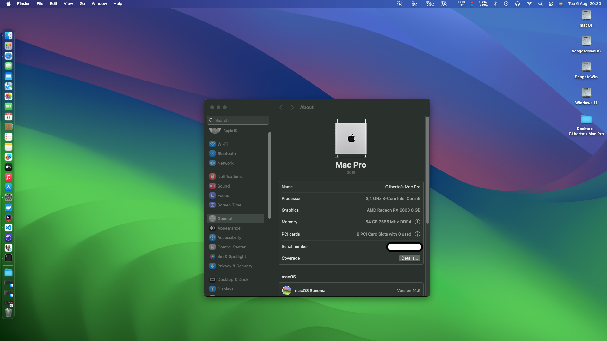
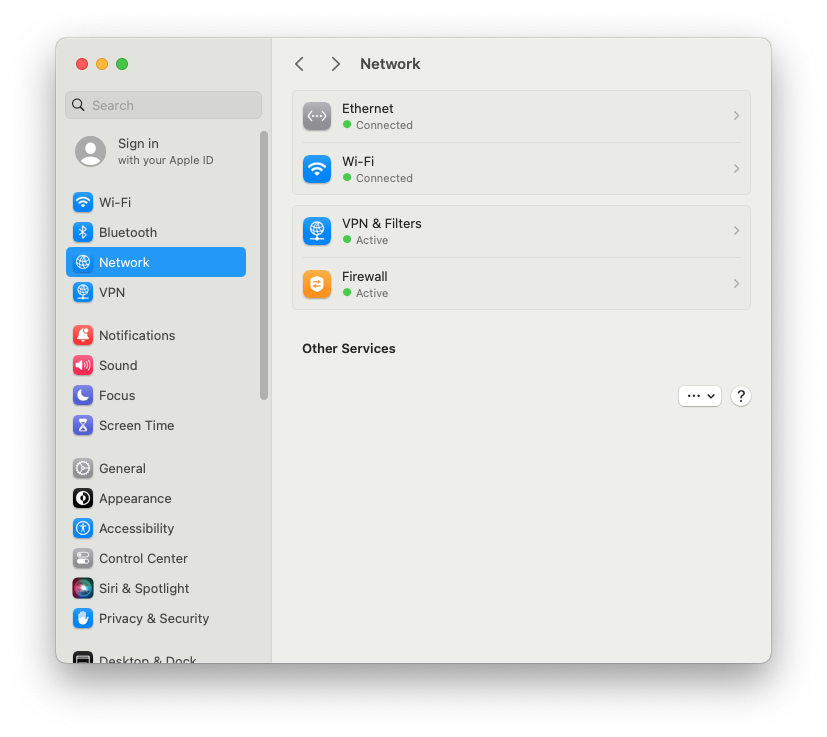
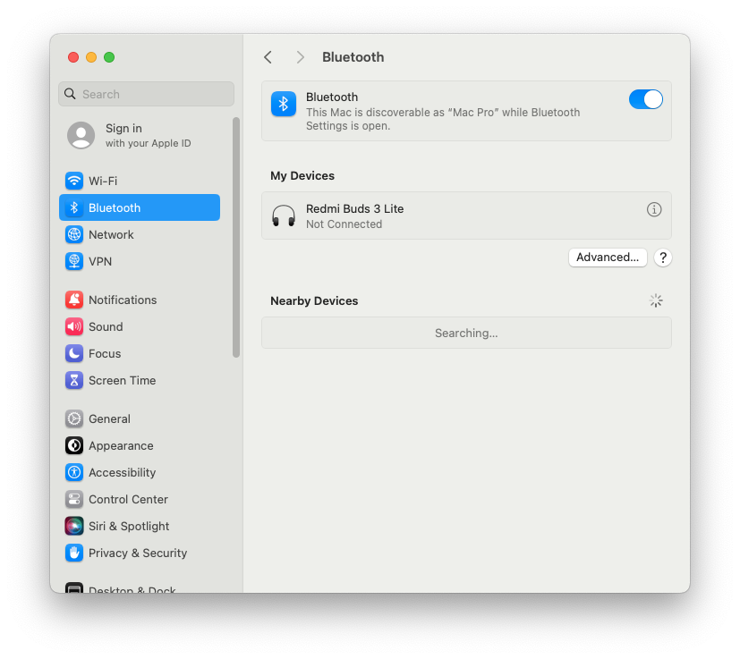

# *EFI OC Z590 AORUS PRO AX macOS Ventura / Sonoma*

##

## *Sistema Operacional*

_**macOS**  **Sonoma 14.4.1**_

##

_**Meu Setup**_

##

- _**Placa Mãe**_
  - <a href="https://www.gigabyte.com/br/Motherboard/Z590-AORUS-PRO-AX-rev-10#kf" target="_blank">*Gigabyte Z590 AORUS PRO AX*</a>
- _**Gabinete**_
  - *Fortress-tg Gamemax*
- **Fonte**
  - *Gigabyte - GP-P550*
- _**CPU**_
  - *Core i9 11900K (QV1K es)*
- _**Water Cooler**_
  - *SUPER FRAME SF-W360*
- _**NVME M.2**_
  - *XPG GAMMIX S41 512GB / macOS*
- _**NVME M.2**_
  - *XPG GAMMIX S41 512GB / Windows 11*
- _**NVME M.2**
  - *XPG GAMMIX S11L 256GB / Ubuntu*
- _**GPU**_
  - *XFX AMD Radeon RX 6600 SWFT 210*
- _**Memória ram**_
  - *CORSAIR VENGEANCE LPX 2x16GB total 32GB*
- _**WI-FI / Bluetooth**_
  - *Intel AX200*
- _**Rede**_
  - *Intel I225-V*  
##

## *O que funciona*

- [x] *Áudio.*
- [x] *Rede.*
- [x] *WI-FI.*
- [x] *Bluetooth.*
- [x] *USB.*
- [x] *Sleep.*
##

## *Resultados Geekbench*
* _**Processador de engenharia QV1K es**_
  * *Por ser um processador de engenharia é necessário chave de ativação do [`Geekbench`](https://www.geekbench.com) para gerar os testes, eu não tenho!*

##

## *Captura de telas*
## *Sobre este mac*

##
##

## *Áudio*

## *Rede Cabeada*

## *Bluetooth*

## *Hackintool Periféricos*

## *Hackintool Versão do OpenCore*

## *Hackintool kexts*

## *Hackintool mapeamento das portas USB*

##

## *Kexts usadas, (todas versões Releases)*

- *[`WhateverGreen.kext`](https://github.com/acidanthera/WhateverGreen)*
- *[`Lilu.kext`](https://github.com/acidanthera/Lilu)*
- *[`VirtualSMC`](https://github.com/acidanthera/VirtualSMC), somente: `VirtualSMC.kext`, `SMCProcessor.kext` e `SMCSuperIO.kext`*.
- *[`AppleInteli210Ethernet.kext`](https://github.com/luchina-gabriel/youtube-files/raw/main/AppleIntelI210Ethernet.kext.zip)*
- *[`AppleIGC.kext`](https://github.com/SongXiaoXi/AppleIGC) como opção caso a sua internet conect mas não navegue, remova AppleInteli210Ethernet.kext e faça um OC Clean Snapshot, isso deve resouver o seu problema de internet* 
- *[`CpuTscSync.kext`](https://github.com/acidanthera/CpuTscSync)*
- *`USBMap.kext`*
- *[`AirportItlwm.kext`](https://github.com/OpenIntelWireless/itlwm/releases) utilizar a versão correspondente ao macOS*
- *[`BluetoolFixup.kext`](https://github.com/acidanthera/BrcmPatchRAM/releases)*
- *[`IntelBluetoothFirmware.kext`](https://github.com/OpenIntelWireless/IntelBluetoothFirmware/releases)*
- *[`IntelBTPatcher.kext`](https://github.com/OpenIntelWireless/IntelBluetoothFirmware/releases)*
##

## *Ferramentas recomendadas*

* _**Recomendação 1**_
  * *Use [`GenSMBIOS`](https://github.com/corpnewt/GenSMBIOS), para gerar novos seriais para sua SMBIOS afim de evitar conflitos com iServices.*
* _**Recomendação 2**_
  * *Use [`ProperTree`](https://github.com/corpnewt/ProperTree), para editar seu config.plist.*     
* _**Recomendação 3**_
  * *Use [`USBMap`](https://github.com/corpnewt/USBMap), para mapear suas portas USB, apartir do OC 0.9.3, pode ser mapeadas com XHCIPortLimit habilitada no config.plist + [`USBInjectAll`](https://github.com/Sniki/OS-X-USB-Inject-All/releases).*
* _**Recomendação 4**_
  * *Extrair sua DSDT a partir do windows.*
  * *Use [`SSDTTime`](https://github.com/corpnewt/SSDTTime), gerar seus patches de SSDT.*    
* _**Recomendação 5**_
  * *Use [`MaciASL`](https://github.com/acidanthera/MaciASL), para compilar seus patches de SSDT.*
* _**Recomendação 6**_
  * *Use [`MountEFI`](https://github.com/corpnewt/MountEFI/blob/update/Mount%20EFI%20Automator%20Quick%20Action.zip), para montar a EFI no macOS*
##

## *Configurações de BIOS Intel*

* _**Desativar**_

  * *Fast Boot*
  * *Secure Boot*
  * *Serial/COM Port*
  * *Parallel Port*
  * *VT-d (pode ser ativado se você definir DisableIoMapper como true)*
  * *Módulo de suporte de compatibilidade (CSM) (deve estar desativado na maioria dos casos, erros/paradas de GPU como gIO são comuns quando esta opção está ativada)*
  * *Thunderbolt (para instalação inicial, pois o Thunderbolt pode causar problemas se não for configurado corretamente)*
  * *Intel SGX*
  * *Intel Platform Trust*
  * *CFG Lock (proteção contra gravação MSR 0xE2) (deve estar desativado, se você não conseguir encontrar a opção, ative AppleXcpmCfgLock em Kernel -> Quirks. Seu hack não inicializará com o CFG-Lock ativado)*

* _**Habilitar**_

  * *VT-x*
  * *Above 4G Decoding (Resizable BAR -> Disable)*
  * *Hyper-Threading*
  * *Execute Disable Bit*
  * *EHCI/XHCI Hand-off*
  * *Tipo de SO: Modo UEFI do Windows 8.1/10 (algumas placas-mãe podem exigir "Outro sistema operacional")*
  * *DVMT pré-alocado (memória iGPU): 64 MB ou superior*
  * *Modo SATA: AHCI*
##

## *Agradecimentos*

- [*Acidanthera Team*](https://github.com/acidanthera)
- [*CorpNewt*](https://github.com/corpnewt)
- [*CrisHotpatch*](https://t.me/crishotpatch)
- [*Dortania*](https://dortania.github.io/OpenCore-Install-Guide/config.plist/comet-lake.html#platforminfo)
- [*Dicas do Mateus*](https://www.youtube.com/c/DicasdoMateus)
- [*Gabriel Luchina*](https://www.youtube.com/c/gabrielluchina)
- [*AppleIGB*](https://github.com/Shaneee/AppleIGB)
- [*AppleIGC*](https://github.com/SongXiaoXi/AppleIGC?tab=readme-ov-file)
- *E outros*

##

## *Licença* 

*The* [*MIT License*](./LICENSE.md) (*MIT*)

*Copyright :copyright: 2023* 
##