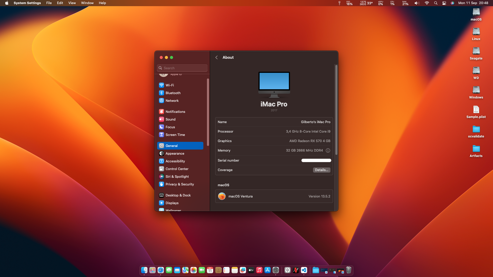
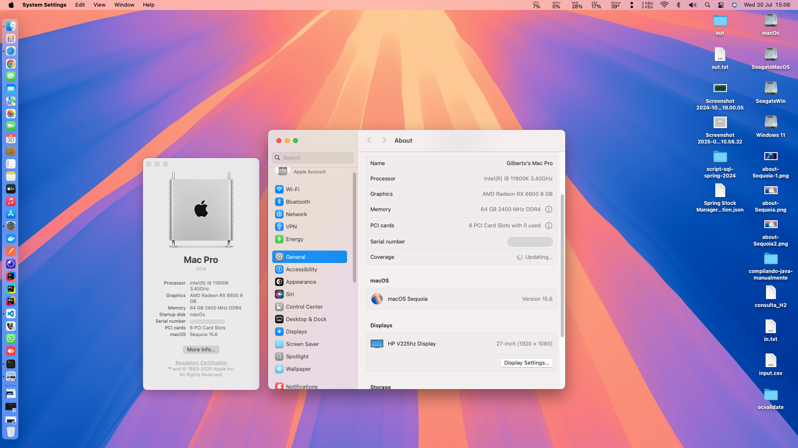
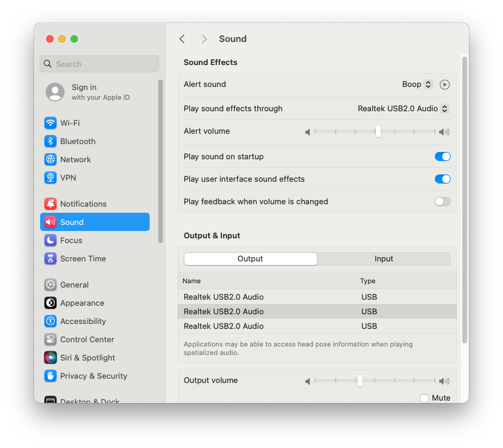
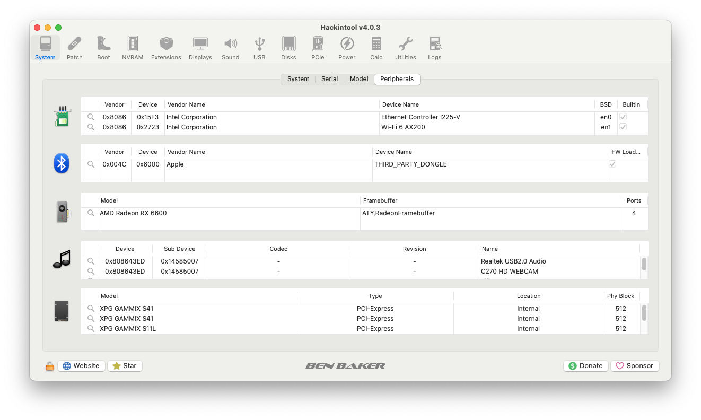
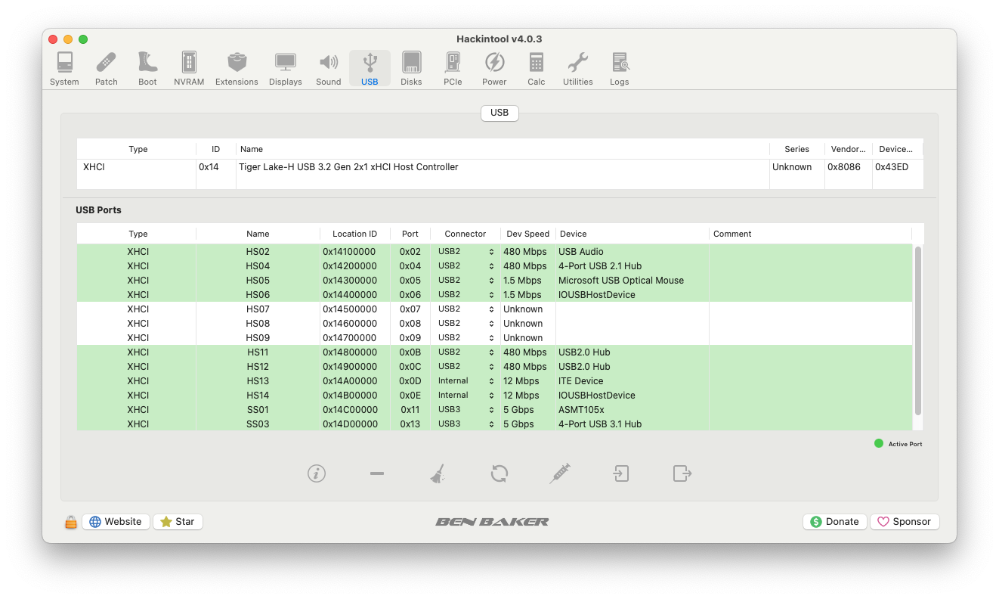

[English](https://github.com/Gilberto-Mascena/Z590-AORUS-PRO-AX/blob/main/README.md) | [Português Brasileiro](https://github.com/Gilberto-Mascena/Z590-AORUS-PRO-AX/blob/main/README-pt_br.md)

# *EFI OC Gigabyte Z590 AORUS PRO AX*

##

## *Operating systems*

  
    
    
  
    

  

---

_**My Setup**_

- _**Motherboard**_
  - <a href="https://www.gigabyte.com/br/Motherboard/Z590-AORUS-PRO-AX-rev-10#kf" target="_blank">*Gigabyte Z590 AORUS PRO AX*</a>
- _**Bios version**_
  - *F11*
- _**PC Case**_
  - *AIGO DARKFLASH C285-BK-4F*
- **Power supply**
  - *SUPER FLOWER - LEGION GX PRO 750W 80 PLUS GOLD*
- _**CPU**_
  - *Core i9 11900K (QV1K es)*
- _**Water Cooler**_
  - *SUPER FRAME SF-W360*
- _**NVME M.2**_
  - *XPG GAMMIX S41 512GB / macOS*
- _**NVME M.2**_
  - *XPG GAMMIX S41 512GB / Windows 11*
- _**NVME M.2**_
  - *XPG GAMMIX S11L 256GB / Ubuntu*
- _**GPU**_
  - *XFX AMD Radeon RX 6600 SWFT 210*
> [!WARNING]
> *Navi21 6000 series has been incorporated into macOS 11.4 and Navi23 into macOS 12.1, for more details, see [Native amd gpus](https://dortania.github.io/GPU-Buyers-Guide/modern-gpus/amd-gpu.html#native-amd-gpus)*

##

- _**Memory**_
  - *CORSAIR VENGEANCE LPX 4x16GB 64GB*
- _**WI-FI / Bluetooth**_
  - *Intel AX200*
> [!NOTE]
> _For more information on compatible Intel WiFi cards, see: [OpenIntelWireless](https://openintelwireless.github.io/itlwm/Compat)_ 

##

- _**Network**_
  - *Intel I225-V*  
---

## _Topic navigation_

- [*What works*](#anchor1)
- [*Geekbench results*](#anchor2)
- [*Screenshot*](#anchor3)
- [*Kexts used, (all Releases)*](#anchor4)
- [*Recommended tools*](#anchor5)
- [*Intel BIOS Settings*](#anchor6)
- [*Thanks*](#anchor7)
- [*License* ](#anchor8)

---

<h2>What works</h2>

- [x] *Sound*
- [x] *Network*
- [x] *WI-FI*
- [x] *Bluetooth*
- [x] *USB*
- [x] *Sleep*

[Top](#anchor)

<h2>Geekbench results</h2>

* _**CPU QV1K es**_
  *As it is an engineering processor, it requires an activation key [`Geekbench`](https://www.geekbench.com) to generate the tests, I don't have it!*

[Top](#anchor)

## Screenshots

---

---

<h2>Sound</h2>

<h2>Wired Network and WI-FI</h2>

<h2>Bluetooth</h2>

<h2>Hackintool Peripherals</h2>

<h2>Hackintool OpenCore Version</h2>

<h2>Hackintool kexts</h2>

<h2>Hackintool USB port mapping</h2>

[Top](#anchor)

<h2>Kexts used, (all Releases)</h2>

- *[`WhateverGreen.kext`](https://github.com/acidanthera/WhateverGreen)*
- *[`Lilu.kext`](https://github.com/acidanthera/Lilu)*
- *[`VirtualSMC`](https://github.com/acidanthera/VirtualSMC), only: `VirtualSMC.kext`, `SMCProcessor.kext` and `SMCSuperIO.kext`*.
- *[`AppleInteli210Ethernet.kext`](https://github.com/luchina-gabriel/youtube-files/raw/main/AppleIntelI210Ethernet.kext.zip)*
- *[`AppleIGC.kext`](https://github.com/SongXiaoXi/AppleIGC) as an option if your internet connects but you can't browse, remove AppleInteli210Ethernet.kext and do an OC Clean Snapshot, this should    solve your internet problem* 
- *[`CpuTscSync.kext`](https://github.com/acidanthera/CpuTscSync)*
- *`USBMap.kext`*
- *[`AirportItlwm.kext`](https://github.com/OpenIntelWireless/itlwm/releases) use the version corresponding to macOS*
- *[`BluetoolFixup.kext`](https://github.com/acidanthera/BrcmPatchRAM/releases)*
- *[`IntelBluetoothFirmware.kext`](https://github.com/OpenIntelWireless/IntelBluetoothFirmware/releases)*
- *[`IntelBTPatcher.kext`](https://github.com/OpenIntelWireless/IntelBluetoothFirmware/releases)*

[Top](#anchor)

<h2>Recommended tools</h2>

* _**Recommendation 1**_
  * *Use [`GenSMBIOS`](https://github.com/corpnewt/GenSMBIOS), to generate new serials for your SMBIOS in order to avoid conflicts with iServices.*
* _**Recommendation 2**_
  * *Use [`ProperTree`](https://github.com/corpnewt/ProperTree), to edit your config.plist.*     
* _**Recommendation 3**_
  * *Use [`USBMap`](https://github.com/corpnewt/USBMap), to map your USB ports, starting from OC 0.9.3, they can be mapped with XHCIPortLimit enabled in config.plist + [`USBInjectAll`](https://github.com/Sniki/OS-X-USB-Inject-All/releases).*
* _**Recommendation 4**_
  * *Extract your DSDT from windows.*
  * *Use [`SSDTTime`](https://github.com/corpnewt/SSDTTime), generate your SSDT patches.*    
* _**Recommendation 5**_
  * *Use [`MaciASL`](https://github.com/acidanthera/MaciASL), to compile your patches on mac SSDT.*
* _**Recommendation 6**_
  * *Use [`MountEFI`](https://github.com/corpnewt/MountEFI/blob/update/Mount%20EFI%20Automator%20Quick%20Action.zip), to mount EFI on macOS.*

[Top](#anchor)

<h2>Intel BIOS Settings</h2>

- [*OpenCore Install Guide*](https://dortania.github.io/OpenCore-Install-Guide/config.plist/comet-lake.html#intel-bios-settings)

[Top](#anchor)

## [_Creating macOS Installer on Windows or Linux_](https://github.com/Gilberto-Mascena/How-to-create-a-macOS-installer-without-a-Mac)

## *Thanks*

- [*Acidanthera Team*](https://github.com/acidanthera)
- [*CorpNewt*](https://github.com/corpnewt)
- [*CrisHotpatch*](https://t.me/crishotpatch)
- [*Dortania*](https://dortania.github.io/OpenCore-Install-Guide/config.plist/comet-lake.html#platforminfo)
- [*Dicas do Mateus*](https://www.youtube.com/c/DicasdoMateus)
- [*Gabriel Luchina*](https://www.youtube.com/c/gabrielluchina)
- [*Shaneee*](https://github.com/Shaneee/AppleIGB)
- [*SongXiaoXi*](https://github.com/SongXiaoXi/AppleIGC?tab=readme-ov-file)
- [*OpenIntelWireless*](https://github.com/OpenIntelWireless)
- *And others*

[Top](#anchor)

## *License* 

*The* [*MIT License*](./LICENSE.md) (*MIT*)

### Gilberto | Dev _2023_ 

[Top](#anchor)

